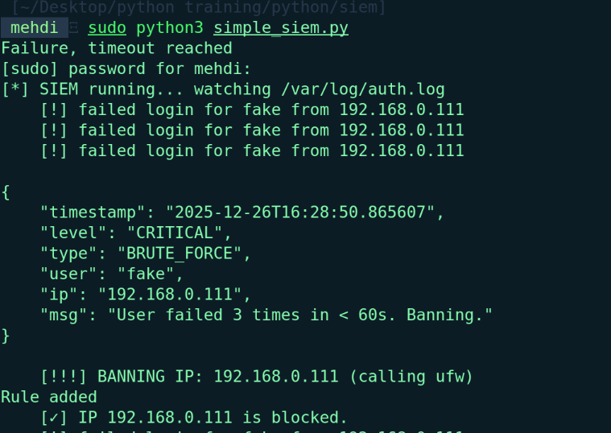

# Custom SIEM & Intrusion Prevention System (IPS)
**A modular security tool built in Python for Linux.**


##  Project Overview
I built this tool to demonstrate how **Security Information and Event Management (SIEM)** systems work under the hood. 

Instead of just using tools like Splunk, I wanted to engineer my own "Mini-SOC" agent that can detect threats and **automatically block them**. It focuses on three core security pillars:
* **Integrity:** Watching critical files for unauthorized changes.
* **Network Analysis:** Detecting port scanners (Reconnaissance).
* **Active Response:** Banning attackers via the Linux Firewall (UFW).

---

##  The Modules

### 1. File Integrity Monitor (FIM)
* **File:** `simple_fim.py`
* **What it does:** Calculates SHA-256 hashes of sensitive files (like passwords or configs).
* **Detection:** If a hacker modifies a file to hide a backdoor, the hash changes, and the system triggers a critical alert immediately.

### 2. Network Intrusion Detector (NIDS)
* **File:** `simple_nids.py`
* **What it does:** Monitors active network connections in real-time.
* **Detection:** Uses heuristic analysis to identify **Port Scanning** (e.g., Nmap). If a single IP hits multiple ports rapidly, it gets flagged as a threat.

### 3. The IPS (Auto-Banner)
* **File:** `simple_siem.py`
* **What it does:** Acts as the brain. It reads system logs (`/var/log/auth.log`) to find Brute Force attacks.
* **The Cool Part:** If it detects 3 failed logins, it talks to the Linux Kernel (UFW) and **automatically bans the attacker's IP**.

---

##  Proof of Concept

**1. Detecting and Banning a Real Attack**
*Here you can see the system detecting a brute-force attempt and adding a firewall rule to block the IP.*


---

##  How to Run It

### Prerequisites
You need Linux (I used Mint/Ubuntu) and a few libraries:
```bash
sudo apt install python3-psutil ufw


